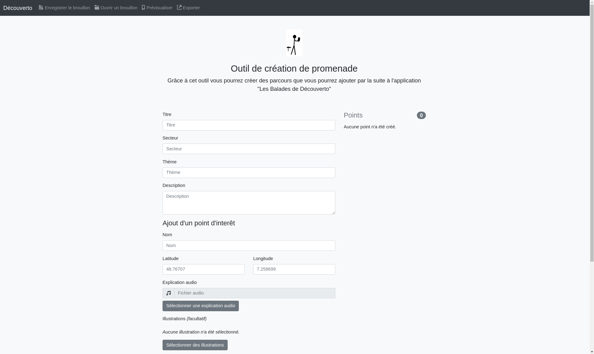

# decouverto-rides-creator

A desktop software to create rides and add them to the main application.

You will have to create a `.googlemaps` file with the [Google Maps API key](https://developers.google.com/maps/android/) in the `src/` folder.

If there are errors when running `npm run make` try to replace the `rcedit.exe` with the [file from the atom repo](https://github.com/atom/node-rcedit/raw/master/bin/rcedit.exe) as mentionned in [this issue](https://github.com/electron-archive/grunt-electron-installer/issues/96).